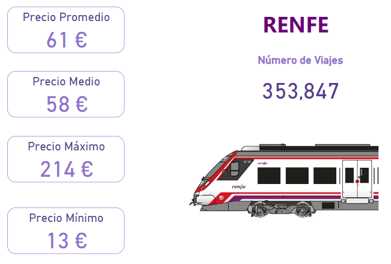

# ABOUT THIS PROJECT

Dataset is a piece of dataset original of Kaggle(about the tickets of tren).

The task is to clean and prepare the data to apply the model, putting the parts de Data Cleaning into practice.

Case for develop: we asume that are a company that wants to compete with Renfe, and we need to know at what price we can offer tickets to win the market

## Workflow

- I worked in `Visual Studio Code` and inside `Jupiter notebooks` 
- I used `Git`
- Libraries `Numpy`, `Pandas` , `Seaborn`
- I show to report in `Power BI`

## Resume

After boarding nulls, duplicates and grouping data and before starting to stantardize my variables, I export  an excel to be able to generate reports in Power BI.

### Overview

Show a resume of information

